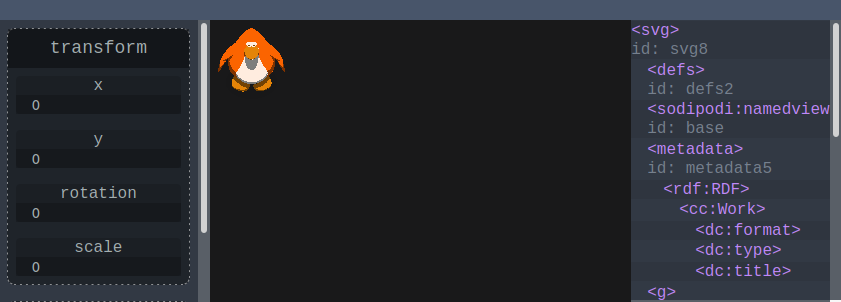

# svgdebug

A web tool for common manipulations needed on svg files

Current features:
- TreeView for selecting elements
- basic renderer (not acceptable)

Planned features:
- edit all svg properties / attributes with a common inspector tool
- transform (scale, translate, rotate) relative to parent, and in world space
- apply transform (saves shape offset to its point data, and resets transform)
- move origins (including to center of point density)
- foldable treeview children
- import / export menu
